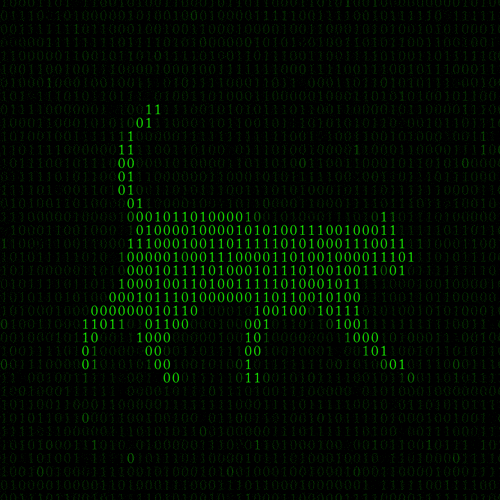

<picture>
  <source media="(max-width: 600px)" srcset="assets/banner_git_mariah_mobile.png">
  
</picture>

<h1 align="center">
Olá, sou Mariah! 👾
</h1>

<h3 align="center">
Desenvolvedora Front-End • Bacharel em Ciência da Computação • João Pessoa, PB 🚀
</h3>

  
  

## 👩‍💻 Sobre mim

Olá! Eu sou a **Mariah** 👋

🎓 Bacharel em Ciência da Computação pela UNIPÊ

💻 Direcionando minha trajetória para o desenvolvimento front-end e web: gosto de construir interfaces organizadas, bonitas e funcionais, com atenção especial à experiência do usuário

🔗 Foco em front-end e integração com back-end

🚀 Desenvolvendo projetos práticos com HTML, CSS, JavaScript, React e Node.js, com destaque para o **SkillUp Dev** e o **GeldTrack**

🎯 Objetivo: conquistar uma vaga como Desenvolvedora Front-End Júnior e transformar ideias em experiências digitais funcionais e intuitivas.

✨ Soft skills: trabalho em equipe, resolução de problemas, comunicação, gestão de tempo, aprendizado contínuo, atenção aos detalhes, criatividade e adaptabilidade.

## 💻 Tecnologias

**Uso no dia a dia**

      

**Já trabalhei com**

          

## 📈 Estatísticas

## 👾 Contribuições
<picture data-importer="pacman">
  <source media="(prefers-color-scheme: dark)" srcset="https://raw.githubusercontent.com/itsmariah/itsmariah/pacman-output/pacman-contribution-graph-dark.svg?game=pacman">
  <source media="(prefers-color-scheme: light)" srcset="https://raw.githubusercontent.com/itsmariah/itsmariah/pacman-output/pacman-contribution-graph.svg?game=pacman">
  
</picture>

###

## 🚀 Atualmente

- 🧁 Desenvolvendo o **MistyDoces**, sistema para uma confeitaria real
- 📱 Construindo o app mobile do **GeldTrack**
- 📚 Complementando os estudos com cursos de Arquitetura Web com IA e Claude Code
- 💼 Disponível para vagas de Desenvolvedora Front-End Júnior e aberta a networking

  

## 🖥️ Projetos

### ⭐ SkillUp Dev
> Plataforma web gamificada voltada ao aprimoramento de soft skills para desenvolvedores, com desafios interativos e feedback automatizado com apoio de IA.

`HTML` `CSS` `JavaScript` `Node.js`

 

### ⭐ GeldTrack (antigo MoneyTrack)
> Plataforma de gestão financeira pessoal e compartilhada: contas, sincronização bancária via Open Finance, relatórios, metas, orçamentos e divisão de despesas em grupo. Funciona na web, como PWA e como app desktop.

`React` `JavaScript` `Node.js` `Express` `PostgreSQL` `Prisma` `Electron` `Vitest`

 

### 🧁 MistyDoces (em desenvolvimento)
> Sistema web completo para uma confeitaria artesanal real: cardápio, pedidos online, pagamento por Pix e cartão via Mercado Pago e painel administrativo com níveis de acesso.

`TypeScript` `Next.js` `React` `Tailwind CSS` `PostgreSQL`

### ✂️ Barbearia Clássica (projeto em equipe)
> Site institucional para uma barbearia fictícia com página de serviços, galeria e formulário de agendamento online.

`HTML` `CSS` `JavaScript`

 

### 🐦 FlappyPy
> Um clone do clássico Flappy Bird feito em Python com Pygame, construído do zero como projeto de estudo de arquitetura de software aplicada a jogos.

`Python` `Pygame`

### 📅 Agenda.AI (em desenvolvimento)
> Sistema web para cadastro de usuários e gerenciamento de agendamentos, simulando aplicações reais de serviços.

`TypeScript` `JavaScript` `CSS` `React`

  

## 🎓 Formação e cursos

- **Bacharelado em Ciência da Computação** — UNIPÊ Centro Universitário · 2022 – 2026
- Imersão Arquitetura Web com IA — Alura · Jul 2026
- Formação Claude Code 2026 — IA com Claude e Cowork — Udemy · Jun 2026
- Compliance e Proteção de Dados — PUCRS · Jun 2026
- Escola de Computação Solidária — Extensionista — UNIPÊ · Mar – Jun 2026
- Algoritmos e Lógica de Programação — Udemy · Abr 2026

## 🌎 Vamos nos conectar!

  

<h4 align="center">
"Transformando ideias em código, uma linha por vez."

✨ Obrigada por visitar meu perfil!
</h4>

  

###
